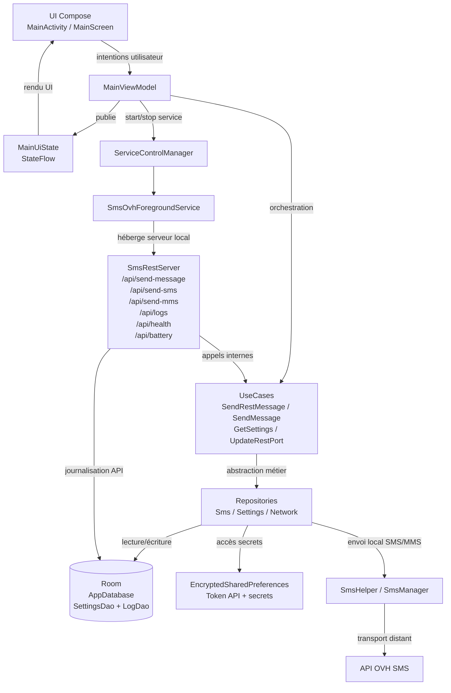

# 🚀 OVH SMS — Application Android Sender ID Alphanumérique


---

> 📱 **Application Android moderne** pour l’envoi de SMS via l’API OVH, avec **gestion sécurisée** des identifiants, **architecture MVVM**, **injection de dépendances (Hilt)**, **Sender ID alphanumérique**, **thèmes personnalisés** et **protection de la confidentialité** (Git).

---

## ✨ Fonctionnalités principales

🟢 **Envoi de SMS** via l’API HTTP OVH avec ou sans Sender ID alphanumérique  
🔒 **Authentification sécurisée** (EncryptedSharedPreferences, MasterKey)  
🏗️ **Architecture MVVM** (ViewModel, UseCase, Repository, DataSource)  
🧩 **Injection de dépendances** avec Hilt  
🔔 **Gestion dynamique des permissions** SMS et batterie (Doze)  
🌍 **Support multilingue** (français/anglais)  
🎨 **Thème clair/sombre**, identité graphique personnalisée  
🖼️ **Icônes vectorielles** importées, projet totalement indépendant  
✅ **Bonnes pratiques Android** (modularité, testabilité)  
🛡️ **Confidentialité** (.gitignore & .git/info/exclude)  
📡 **Journalisation automatique** des statuts SMS (succès/échec) via une API locale (`/api/logs`)  
🌐 **Détection dynamique de l’IP locale** pour l’API de logs (NetworkInfoProvider)  
🔄 **Gestion avancée des erreurs SIM/SMS** (retours contextualisés, logs API)  
🧑‍💻 **Icône d’application dynamique** : couleurs du thème appliquées à l’icône (vectorielle, support clair/sombre)  
🌐 **Affichage de l’IP active et des endpoints** dans l’interface principale  
🚫 **Suppression de toute URL d’envoi et de tout affichage de logs/statuts** dans l’interface utilisateur

---

## 🏗️ Architecture MVVM & Journalisation




---


## 🔒 Sécurité & Confidentialité

> 🔒 **Sécurité & Confidentialité**
>
> - 🔑 **Identifiants OVH + token API** stockés localement de manière sécurisée (`EncryptedSharedPreferences` + `MasterKey`)
> - 🛢️ **Séparation des données** : les réglages applicatifs sont persistés via Room, les secrets restent hors base en clair
> - 🛡️ **API locale protégée par Bearer token** avec validation des entrées et réponses d’erreur JSON
> - 📲 **Principe du moindre privilège** : permissions demandées en runtime uniquement quand nécessaire (SMS, localisation, batterie)
> - 🔔 **Disponibilité contrôlée** : foreground service + gestion batterie/optimisation pour limiter les interruptions
> - 🗂️ **Hygiène Git renforcée** : exclusions actives (`.gitignore`, `.git/info/exclude`) pour secrets, fichiers IDE, build, APK et artefacts lourds

---

## 📦 Technologies & Bonnes pratiques

- 🟣 **Kotlin + AndroidX** (app moderne, base maintenable)
- 🎨 **Jetpack Compose** pour l’interface (`MainScreen`, composants UI dédiés)
- 🏗️ **Architecture MVVM** avec `ViewModel` + `UiState` (StateFlow)
- 🧠 **Domain layer** avec **UseCases** et séparation claire des responsabilités
- 🗂️ **Repository pattern** (`data/repository`) + sources locales/techniques
- 🧩 **Hilt (DI)** pour l’injection des dépendances à l’échelle de l’application
- 🛢️ **Room** pour la persistance locale des réglages et logs (avec limites de rétention)
- 🌐 **API REST locale** embarquée (NanoHTTPD) pour l’exécution distante SMS/MMS
- 🔐 **Sécurité locale**: token API + `EncryptedSharedPreferences` (MasterKey)
- 🔔 **Permissions runtime** et gestion batterie (foreground service, optimisation)
- 🌗 **Thème clair/sombre** aligné sur la configuration système
- 🌍 **Internationalisation FR/EN** via ressources `values` / `values-fr` / `values-en`
- 🧪 **Tests unitaires et instrumentés** (service, viewmodel, circuits API/SMS)

---

## 📁 Structure du projet

```
app/
├── src/
│   ├── main/
│   │   ├── AndroidManifest.xml
│   │   ├── java/com/miseservice/smsovh/
│   │   │   ├── SmsOvhApp.kt               ← Application + bootstrap global
│   │   │   ├── di/                        ← Modules Hilt (bind/provide)
│   │   │   ├── data/
│   │   │   │   ├── datasource/            ← Sources techniques
│   │   │   │   ├── repository/            ← Implémentations Repository
│   │   │   │   └── local/                 ← Room (DB, DAO, Entity)
│   │   │   ├── domain/
│   │   │   │   ├── repository/            ← Contrats métier
│   │   │   │   └── usecase/               ← Cas d’usage (orchestration)
│   │   │   ├── service/                   ← Foreground service + serveur REST local
│   │   │   ├── util/                      ← Helpers (SMS, token, réseau, permissions)
│   │   │   ├── viewmodel/                 ← MainViewModel + UI state
│   │   │   ├── ui/
│   │   │   │   ├── MainActivity.kt
│   │   │   │   ├── MainScreen.kt          ← UI Jetpack Compose
│   │   │   │   ├── components/            ← Sections composables
│   │   │   │   └── theme/                 ← Couleurs/typo/thèmes light/dark
│   │   │   └── model/                     ← Modèles partagés
│   │   └── res/                           ← Ressources Android (values, mipmap, xml...)
│   ├── test/java/com/miseservice/smsovh/  ← Tests unitaires (service, viewmodel, util)
│   └── androidTest/java/com/miseservice/smsovh/
│       ├── ApiCircuitTest.kt              ← Tests instrumentés API locale
│       └── LocalSmsCircuitTest.kt         ← Tests instrumentés envoi local
├── build.gradle
└── ...
```

---

## 🚀 Installation & Lancement

```bash
# Cloner le projet
# Ouvrir dans Android Studio
# Sync Gradle puis Run sur un appareil réel ou un émulateur
```

---


## 🌐 API REST locale - Accès & Endpoints

### Authentification

- Toutes les routes REST locales sont protégées par token.
- Header obligatoire: `Authorization: Bearer <TOKEN_API>`
- Le token API est généré/copiable depuis l'interface de l'application.
- Sans token valide, la réponse est: `401 Unauthorized`.

### Base URL

- `http://<IP_DU_TELEPHONE>:<PORT>`
- Exemple: `http://<IP_DU_TELEPHONE>:<PORT>`

### Endpoints disponibles

| Methode | Endpoint | Description | Body JSON |
|---|---|---|---|
| `POST` | `/api/send-message` | Envoi intelligent SMS/MMS selon presence de `base64Jpeg` | `senderId?`, `recipient`, `text`, `base64Jpeg?` |
| `POST` | `/api/send-sms` | Envoi SMS texte | `senderId?`, `recipient`, `text` |
| `POST` | `/api/send-mms` | Envoi MMS avec image | `senderId?`, `recipient`, `text?`, `base64Jpeg` |
| `GET` | `/api/logs` | Retourne les 5 derniers logs persistés | Aucun |
| `POST` | `/api/logs` | Ajoute un log applicatif | `message` |
| `GET` | `/api/health` | Vérifie l'état du serveur REST local | Aucun |
| `GET` | `/api/battery` | Retourne l'état batterie du téléphone | Aucun |

### Exemples de requêtes

```bash
curl -X POST "http://<IP_DU_TELEPHONE>:<PORT>/api/send-message" -H "Content-Type: application/json" -H "Authorization: Bearer <TOKEN_API>" -d "{\"senderId\":\"MYBRAND\",\"recipient\":\"+33612345678\",\"text\":\"Test REST\",\"base64Jpeg\":\"\"}"
curl -X GET "http://<IP_DU_TELEPHONE>:<PORT>/api/logs" -H "Authorization: Bearer <TOKEN_API>"
curl -X GET "http://<IP_DU_TELEPHONE>:<PORT>/api/health" -H "Authorization: Bearer <TOKEN_API>"
curl -X GET "http://<IP_DU_TELEPHONE>:<PORT>/api/battery" -H "Authorization: Bearer <TOKEN_API>"
```

### Formats de reponses JSON

Succes (`200`):

```json
{
  "success": true,
  "message": "SMS envoyé avec succès",
  "timestamp": 1775227009115,
  "type": "SMS"
}
```

Erreur (`400`, `401`, `404`, `500`):

```json
{
  "success": false,
  "error": "Missing request body",
  "code": 400,
  "timestamp": 1775226365345
}
```

Réponse dédiée `/api/battery` (`200`):

```json
{
  "success": true,
  "level": 78,
  "isCharging": false,
  "timestamp": 1775227009115
}
```

### Regles de validation importantes

- `recipient` est obligatoire pour les envois SMS/MMS et est normalisé avant envoi.
- `text` est obligatoire pour `/api/send-message` et `/api/send-sms`.
- `base64Jpeg` est obligatoire pour `/api/send-mms`.
- En cas d'erreur de validation, l'API renvoie un JSON d'erreur (jamais de HTML).
- `/api/battery` renvoie le pattern: `success`, `level`, `isCharging`, `timestamp`.

### Format image `base64Jpeg` (MMS)

- Format attendu: image JPEG encodée en Base64 (chaîne texte).
- Le serveur accepte:
  - Base64 brut: `"/9j/4AAQSkZJRgABAQ..."`
  - Data URI: `"data:image/jpeg;base64,/9j/4AAQSkZJRgABAQ..."`
- Espaces et retours à la ligne sont nettoyés côté serveur.
- Taille recommandée: <= 3 MB (limite MMS configurée dans l'app).

Exemple Python:

```python
import base64

with open("image.jpg", "rb") as f:
    base64_jpeg = base64.b64encode(f.read()).decode("utf-8")

payload = {
    "senderId": "MYBRAND",
    "recipient": "+33612345678",
    "text": "MMS test",
    "base64Jpeg": base64_jpeg
}
```

Exemple PHP:

```php
<?php
$bytes = file_get_contents('image.jpg');
$base64Jpeg = base64_encode($bytes);

$payload = [
    'senderId' => 'MYBRAND',
    'recipient' => '+33612345678',
    'text' => 'MMS test',
    'base64Jpeg' => $base64Jpeg,
];
```

Exemple Android (Kotlin):

```kotlin
import android.util.Base64
import java.io.File

val imageBytes = File("/sdcard/Download/image.jpg").readBytes()
val base64Jpeg = Base64.encodeToString(imageBytes, Base64.NO_WRAP)

val payload = mapOf(
    "senderId" to "MYBRAND",
    "recipient" to "+33612345678",
    "text" to "MMS test",
    "base64Jpeg" to base64Jpeg
)
```

---

## 📡 API OVH utilisée

- Appel HTTP GET à l’API OVH SMS (voir doc officielle)
- Gestion des codes retour (100 = succès, 201/202 = erreur login/mdp, etc.)

---

## ⚠️ Limitations du Sender ID alphanumérique

> ⚠️ **Limitations du Sender ID alphanumérique**
>
> - Max 11 caractères (lettres/chiffres)
> - Pas de réponse possible
> - Doit être validé chez OVH
> - Certains opérateurs/pays peuvent le bloquer

---

## 🤝 Support & Contributions

Pour toute question ou contribution, ouvrez une issue ou une pull request.

---

> © 2026 MISESERVICE — Architecture MVVM, sécurité, confidentialité et bonnes pratiques Android.
