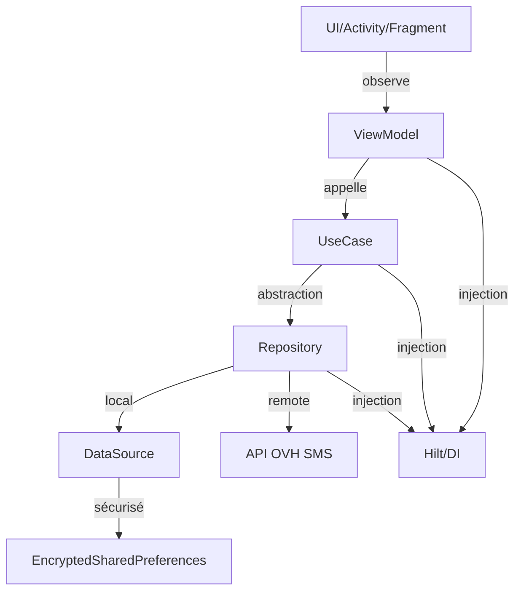

# 🚀 OVH SMS — Application Android Sender ID Alphanumérique

<div align="center">
  
  
  
  
</div>

---

<div style="background:#F0F8FF;padding:1em;border-radius:8px;border:1px solid #3D8BFF;">
<b>📱 Application Android moderne</b> pour l’envoi de SMS via l’API OVH, avec <b>gestion sécurisée</b> des identifiants, <b>architecture MVVM</b>, <b>injection de dépendances (Hilt)</b>, <b>Sender ID alphanumérique</b>, <b>thèmes personnalisés</b> et <b>protection de la confidentialité</b> (Git).
</div>

---

## ✨ Fonctionnalités principales

🟢 <b>Envoi de SMS</b> via l’API HTTP OVH avec ou sans Sender ID alphanumérique<br>
🔒 <b>Authentification sécurisée</b> (EncryptedSharedPreferences, MasterKey)<br>
🏗️ <b>Architecture MVVM</b> (ViewModel, UseCase, Repository, DataSource)<br>
🧩 <b>Injection de dépendances</b> avec Hilt<br>
🔔 <b>Gestion dynamique des permissions</b> SMS et batterie (Doze)<br>
🌍 <b>Support multilingue</b> (français/anglais)<br>
🎨 <b>Thème clair/sombre</b>, identité graphique personnalisée<br>
🖼️ <b>Icônes vectorielles</b> importées, projet totalement indépendant<br>
✅ <b>Bonnes pratiques Android</b> (modularité, testabilité)<br>
🛡️ <b>Confidentialité</b> (.gitignore & .git/info/exclude)

---

## 🏗️ Architecture MVVM

<div style="background:#E7ECF1;padding:1em;border-radius:8px;border:1px solid #3D8BFF;">



</div>

---

## 🔒 Sécurité & Confidentialité

<div style="background:#F7F1EB;padding:1em;border-radius:8px;border:1px solid #F08A3C;">

- 🔑 <b>Identifiants OVH</b> stockés uniquement via EncryptedSharedPreferences (MasterKey AndroidX)
- 🚫 <b>Aucune donnée sensible</b> dans le code source ou le dépôt Git
- 🗂️ <b>.gitignore</b> et <b>.git/info/exclude</b> configurés pour exclure `.idea/`, `local.properties`, fichiers de build, APK, logs, etc.
- 🛡️ <b>Permissions Android</b> gérées dynamiquement (SMS, batterie, foreground service)

</div>

---

## 📦 Technologies & Bonnes pratiques

- 🟣 Kotlin, AndroidX, Material Components
- 🏗️ MVVM, UseCase, Repository, DataSource
- 🧩 Hilt (injection de dépendances)
- 🔒 EncryptedSharedPreferences, MasterKey
- 🔔 Gestion runtime des permissions (SMS, batterie)
- 🎨 Thème clair/sombre, ressources vectorielles
- 🌍 Multilingue (français/anglais)
- 🧪 Tests unitaires (ViewModel, UseCase)

---

## 📁 Structure du projet

<div style="background:#F3F5F7;padding:1em;border-radius:8px;border:1px solid #C46A2F;">

```
app/
├── src/main/
│   ├── java/com/miseservice/smsovh/
│   │   ├── di/                ← Modules Hilt
│   │   ├── data/              ← Repository, DataSource
│   │   ├── domain/            ← UseCases
│   │   ├── ui/                ← ViewModel, Activity, Fragment
│   │   └── App.kt             ← Application (Hilt)
│   ├── res/
│   │   ├── layout/            ← activity_main.xml, etc.
│   │   ├── values/            ← colors.xml, strings.xml, themes.xml
│   │   ├── drawable/          ← ic_launcher, icônes vectorielles
│   │   └── mipmap*/           ← ic_launcher, etc.
│   └── AndroidManifest.xml
├── build.gradle
└── ...
```

</div>

---

## 🚀 Installation & Lancement

<div style="background:#E7ECF1;padding:1em;border-radius:8px;border:1px solid #3D8BFF;">

```bash
# Cloner le projet
# Ouvrir dans Android Studio
# Sync Gradle puis Run sur un appareil réel ou un émulateur
```

</div>

---

## 🧹 Nettoyage GitHub & Fichiers volumineux

<div style="background:#FFF3CD;padding:1em;border-radius:8px;border:1px solid #FBBF24;">

- Le dépôt a été nettoyé avec [BFG Repo-Cleaner](https://rtyley.github.io/bfg-repo-cleaner/) pour supprimer tous les fichiers volumineux (>100 Mo) de l’historique Git (ex : .zip, .jar, gradle-8.5-bin/).
- Le fichier `.gitignore` protège désormais contre l’ajout de tout fichier binaire ou archive inutile (voir la racine du projet).
- **Limite GitHub :** aucun fichier >100 Mo n’est accepté, et il est recommandé de ne pas dépasser 50 Mo par fichier.
- Après nettoyage, il est conseillé de recloner le dépôt pour éviter tout conflit d’historique.

</div>

---

## 📝 Confidentialité Git

<div style="background:#F7F1EB;padding:1em;border-radius:8px;border:1px solid #F08A3C;">

- `.gitignore` :
  - Exclut `.idea/`, `*.iml`, `local.properties`, `build/`, `*.apk`, `*.zip`, `*.jar`, `gradle-8.5-bin/`, etc.
  - Protège contre l’ajout de fichiers volumineux ou sensibles.
- `.git/info/exclude` :
  - Exclut localement les fichiers sensibles même si `.gitignore` est modifié
- **Historique GitHub nettoyé** :
  - Tous les fichiers binaires volumineux ont été supprimés de l’historique avec BFG.
  - Si vous aviez cloné le dépôt avant mars 2026, reclonez-le pour éviter les erreurs de push.

</div>

---

## 📡 API OVH utilisée

- Appel HTTP GET à l’API OVH SMS (voir doc officielle)
- Gestion des codes retour (100 = succès, 201/202 = erreur login/mdp, etc.)

---

## ⚠️ Limitations du Sender ID alphanumérique

<div style="background:#FFF3CD;padding:1em;border-radius:8px;border:1px solid #FBBF24;">

- Max 11 caractères (lettres/chiffres)
- Pas de réponse possible
- Doit être validé chez OVH
- Certains opérateurs/pays peuvent le bloquer

</div>

---

## 🤝 Support & Contributions

Pour toute question ou contribution, ouvrez une issue ou une pull request.

---

<div align="center" style="background:#F0F8FF;padding:1em;border-radius:8px;border:1px solid #3D8BFF;">
© 2026 MISESERVICE — Architecture MVVM, sécurité, confidentialité et bonnes pratiques Android.
</div>
