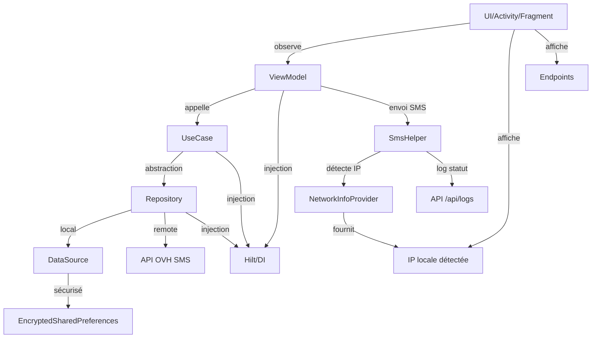

# 🚀 OVH SMS — Application Android Sender ID Alphanumérique


---

> 📱 **Application Android moderne** pour l’envoi de SMS via l’API OVH, avec **gestion sécurisée** des identifiants, **architecture MVVM**, **injection de dépendances (Hilt)**, **Sender ID alphanumérique**, **thèmes personnalisés** et **protection de la confidentialité** (Git).

---

## ✨ Fonctionnalités principales

🟢 **Envoi de SMS** via l’API HTTP OVH avec ou sans Sender ID alphanumérique  
🔒 **Authentification sécurisée** (EncryptedSharedPreferences, MasterKey)  
🏗️ **Architecture MVVM** (ViewModel, UseCase, Repository, DataSource)  
🧩 **Injection de dépendances** avec Hilt  
🔔 **Gestion dynamique des permissions** SMS et batterie (Doze)  
🌍 **Support multilingue** (français/anglais)  
🎨 **Thème clair/sombre**, identité graphique personnalisée  
🖼️ **Icônes vectorielles** importées, projet totalement indépendant  
✅ **Bonnes pratiques Android** (modularité, testabilité)  
🛡️ **Confidentialité** (.gitignore & .git/info/exclude)  
📡 **Journalisation automatique** des statuts SMS (succès/échec) via une API locale (`/api/logs`)  
🌐 **Détection dynamique de l’IP locale** pour l’API de logs (NetworkInfoProvider)  
🔄 **Gestion avancée des erreurs SIM/SMS** (retours contextualisés, logs API)  
🧑‍💻 **Icône d’application dynamique** : couleurs du thème appliquées à l’icône (vectorielle, support clair/sombre)  
🌐 **Affichage de l’IP active et des endpoints** dans l’interface principale  
🚫 **Suppression de toute URL d’envoi et de tout affichage de logs/statuts** dans l’interface utilisateur

---

## 🏗️ Architecture MVVM & Journalisation



---

## 🆕 Nouveautés (mars 2026)

- 🎨 L’icône d’application utilise désormais les couleurs du thème (vectorielle, support clair/sombre)
- 🌐 L’IP active et la liste des endpoints sont affichées dans l’interface principale
- 🚫 L’URL d’envoi n’est plus visible ni modifiable par l’utilisateur
- 🚫 Plus aucun log/statut n’est affiché dans l’interface (tout est envoyé par API)
- 🧹 Nettoyage du code : suppression de toute la logique d’URL API, logs/statuts côté UI/ViewModel

---

## 🔒 Sécurité & Confidentialité

> 🔒 **Sécurité & Confidentialité**
>
> - 🔑 **Identifiants OVH + token API** stockés localement de manière sécurisée (`EncryptedSharedPreferences` + `MasterKey`)
> - 🛢️ **Séparation des données** : les réglages applicatifs sont persistés via Room, les secrets restent hors base en clair
> - 🛡️ **API locale protégée par Bearer token** avec validation des entrées et réponses d’erreur JSON
> - 📲 **Principe du moindre privilège** : permissions demandées en runtime uniquement quand nécessaire (SMS, localisation, batterie)
> - 🔔 **Disponibilité contrôlée** : foreground service + gestion batterie/optimisation pour limiter les interruptions
> - 🗂️ **Hygiène Git renforcée** : exclusions actives (`.gitignore`, `.git/info/exclude`) pour secrets, fichiers IDE, build, APK et artefacts lourds

---

## 📦 Technologies & Bonnes pratiques

- 🟣 **Kotlin + AndroidX** (app moderne, base maintenable)
- 🎨 **Jetpack Compose** pour l’interface (`MainScreen`, composants UI dédiés)
- 🏗️ **Architecture MVVM** avec `ViewModel` + `UiState` (StateFlow)
- 🧠 **Domain layer** avec **UseCases** et séparation claire des responsabilités
- 🗂️ **Repository pattern** (`data/repository`) + sources locales/techniques
- 🧩 **Hilt (DI)** pour l’injection des dépendances à l’échelle de l’application
- 🛢️ **Room** pour la persistance locale des réglages et logs (avec limites de rétention)
- 🌐 **API REST locale** embarquée (NanoHTTPD) pour l’exécution distante SMS/MMS
- 🔐 **Sécurité locale**: token API + `EncryptedSharedPreferences` (MasterKey)
- 🔔 **Permissions runtime** et gestion batterie (foreground service, optimisation)
- 🌗 **Thème clair/sombre** aligné sur la configuration système
- 🌍 **Internationalisation FR/EN** via ressources `values` / `values-fr` / `values-en`
- 🧪 **Tests unitaires et instrumentés** (service, viewmodel, circuits API/SMS)

---

## 📁 Structure du projet

```
app/
├── src/
│   ├── main/
│   │   ├── AndroidManifest.xml
│   │   ├── java/com/miseservice/smsovh/
│   │   │   ├── SmsOvhApp.kt               ← Application + bootstrap global
│   │   │   ├── di/                        ← Modules Hilt (bind/provide)
│   │   │   ├── data/
│   │   │   │   ├── datasource/            ← Sources techniques
│   │   │   │   ├── repository/            ← Implémentations Repository
│   │   │   │   └── local/                 ← Room (DB, DAO, Entity)
│   │   │   ├── domain/
│   │   │   │   ├── repository/            ← Contrats métier
│   │   │   │   └── usecase/               ← Cas d’usage (orchestration)
│   │   │   ├── service/                   ← Foreground service + serveur REST local
│   │   │   ├── util/                      ← Helpers (SMS, token, réseau, permissions)
│   │   │   ├── viewmodel/                 ← MainViewModel + UI state
│   │   │   ├── ui/
│   │   │   │   ├── MainActivity.kt
│   │   │   │   ├── MainScreen.kt          ← UI Jetpack Compose
│   │   │   │   ├── components/            ← Sections composables
│   │   │   │   └── theme/                 ← Couleurs/typo/thèmes light/dark
│   │   │   └── model/                     ← Modèles partagés
│   │   └── res/                           ← Ressources Android (values, mipmap, xml...)
│   ├── test/java/com/miseservice/smsovh/  ← Tests unitaires (service, viewmodel, util)
│   └── androidTest/java/com/miseservice/smsovh/
│       ├── ApiCircuitTest.kt              ← Tests instrumentés API locale
│       └── LocalSmsCircuitTest.kt         ← Tests instrumentés envoi local
├── build.gradle
└── ...
```

---

## 🚀 Installation & Lancement

```bash
# Cloner le projet
# Ouvrir dans Android Studio
# Sync Gradle puis Run sur un appareil réel ou un émulateur
```

---

## 🧹 Nettoyage GitHub & Fichiers volumineux

> 🧹 **Nettoyage GitHub & Fichiers volumineux**
>
> - Le dépôt a été nettoyé avec [BFG Repo-Cleaner](https://rtyley.github.io/bfg-repo-cleaner/) pour supprimer tous les fichiers volumineux (>100 Mo) de l’historique Git (ex : `.zip`, `.jar`, `gradle-8.5-bin/`).
> - Le fichier `.gitignore` protège désormais contre l’ajout de tout fichier binaire ou archive inutile (voir la racine du projet).
> - **Limite GitHub :** aucun fichier >100 Mo n’est accepté, et il est recommandé de ne pas dépasser 50 Mo par fichier.
> - Après nettoyage, il est conseillé de recloner le dépôt pour éviter tout conflit d’historique.

---


## 📝 Confidentialité Git

> 📝 **Confidentialité Git**
>
> - `.gitignore` :
>   - Exclut `.idea/`, `*.iml`, `local.properties`, `build/`, `*.apk`, `*.zip`, `*.jar`, `gradle-8.5-bin/`, etc.
>   - Protège contre l’ajout de fichiers volumineux ou sensibles.
> - `.git/info/exclude` :
>   - Exclut localement les fichiers sensibles même si `.gitignore` est modifié
> - **Historique GitHub nettoyé** :
>   - Tous les fichiers binaires volumineux ont été supprimés de l’historique avec BFG.
>   - Si vous aviez cloné le dépôt avant mars 2026, reclonez-le pour éviter les erreurs de push.

---

## 📡 API OVH utilisée

- Appel HTTP GET à l’API OVH SMS (voir doc officielle)
- Gestion des codes retour (100 = succès, 201/202 = erreur login/mdp, etc.)

---

## ⚠️ Limitations du Sender ID alphanumérique

> ⚠️ **Limitations du Sender ID alphanumérique**
>
> - Max 11 caractères (lettres/chiffres)
> - Pas de réponse possible
> - Doit être validé chez OVH
> - Certains opérateurs/pays peuvent le bloquer

---

## 🤝 Support & Contributions

Pour toute question ou contribution, ouvrez une issue ou une pull request.

---

> © 2026 MISESERVICE — Architecture MVVM, sécurité, confidentialité et bonnes pratiques Android.
